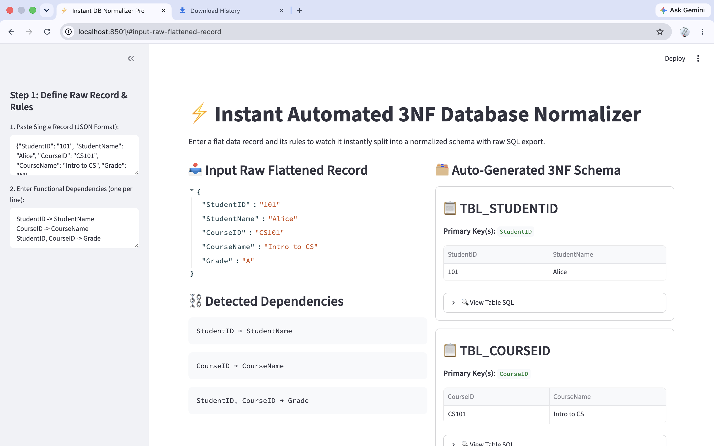
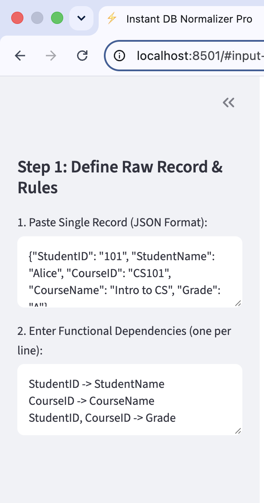
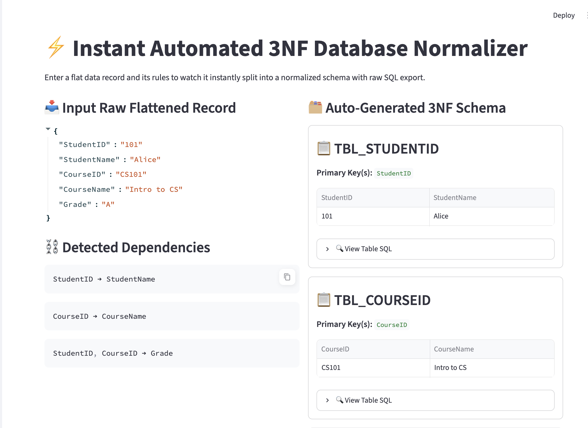
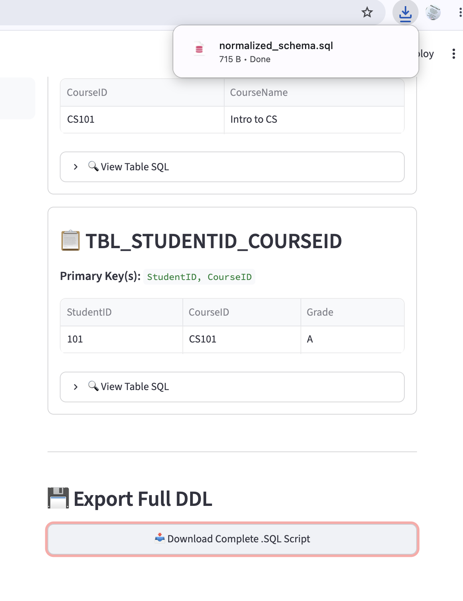

# 🚀 Automated Database Normalizer

A Python-based web application that automates database normalization up to **Third Normal Form (3NF)**. The application allows users to enter a flat JSON record and functional dependencies, then automatically generates normalized database tables, SQL scripts, and downloadable database schema files through an interactive web interface.

---
## 🏠 Home Screen

Complete web interface of the Automated Database Normalizer.



---

## ✨ Features

- 📥 Accepts raw data in JSON format
- 🔗 Accepts user-defined Functional Dependencies (FDs)
- ⚡ Automatically generates 3NF tables
- 🗂️ Displays normalized tables interactively
- 🔑 Identifies primary keys for each relation
- 📝 Generates SQL `CREATE TABLE` statements
- 💾 Generates SQL `INSERT` statements
- 📥 Download complete SQL schema as a `.sql` file

---

# 📸 Application Screenshots


## 📥 Input Data

Users provide a JSON record and functional dependencies.



---

## 🗂️ Normalized Tables

Automatically generated normalized tables after processing the input.



---

## 💾 SQL Export

Download the generated SQL script containing `CREATE TABLE` and `INSERT` statements.



---

## 🛠️ Technologies Used

- Python
- Streamlit
- Pandas
- JSON
- SQL

---

## 📂 Project Structure

```text
automated-database-normalizer/
│
├── app.py
├── README.md
├── requirements.txt
├── .gitignore
├── screenshots/
│   ├── homepage.png
│   ├── input.png
│   ├── normalized_tables.png
│   └── export_sql.png
└── venv/
```

---

## 🚀 How to Run the Project

### 1. Clone the repository

```bash
git clone https://github.com/YOUR_USERNAME/automated-database-normalizer.git
```

### 2. Open the project folder

```bash
cd automated-database-normalizer
```

### 3. Create a virtual environment

```bash
python -m venv venv
```

### 4. Activate the virtual environment

### macOS / Linux

```bash
source venv/bin/activate
```

### Windows

```bash
venv\Scripts\activate
```

### 5. Install dependencies

```bash
pip install -r requirements.txt
```

### 6. Run the application

```bash
streamlit run app.py
```

---

# 📥 Example Input

### JSON Record

```json
{
  "StudentID": "101",
  "StudentName": "Alice",
  "CourseID": "CS101",
  "CourseName": "Intro to CS",
  "Grade": "A"
}
```

### Functional Dependencies

```text
StudentID -> StudentName
CourseID -> CourseName
StudentID, CourseID -> Grade
```

---

# 📊 Output

The application automatically:

- Creates normalized database tables
- Displays each relation in tabular format
- Identifies primary keys
- Generates SQL `CREATE TABLE` statements
- Generates SQL `INSERT` statements
- Allows users to download the complete SQL script

---

# 🎯 Project Motivation

Database normalization is an essential part of database design, but it is often performed manually during coursework and practice. This project simplifies that process by providing an interactive application that converts a flat data record into a normalized database schema based on user-defined functional dependencies.

The project bridges database theory with practical software development by combining Python, Streamlit, and SQL into a single interactive application.

---

# 🔮 Future Improvements

- Candidate Key Detection
- Minimal Cover Generation
- BCNF Normalization
- Automatic Foreign Key Generation
- CSV File Upload Support
- ER Diagram Generation
- Better SQL Data Type Inference
- Support for Multiple Records

---

# 👨‍💻 Author

**SAHIL Jangra**

---

## ⭐ If you found this project useful, consider giving it a star!